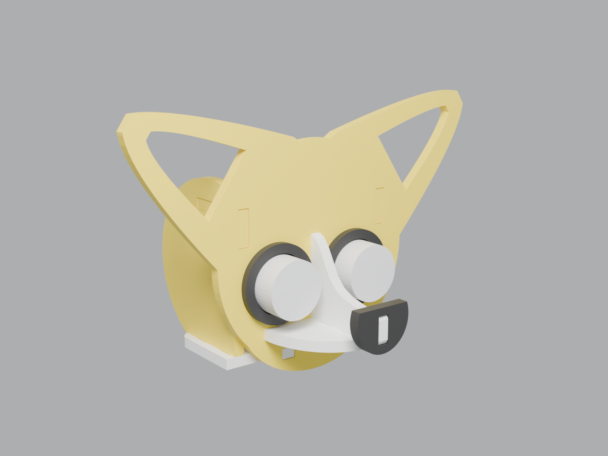
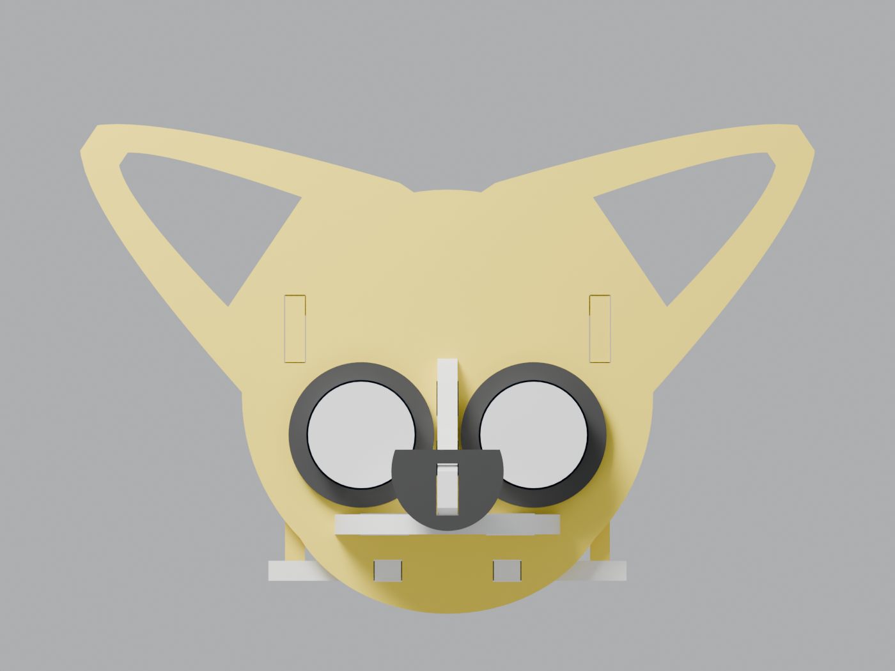
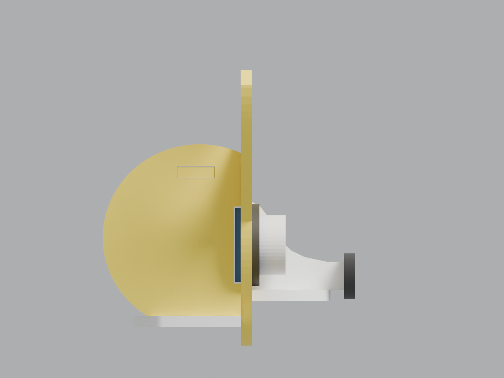
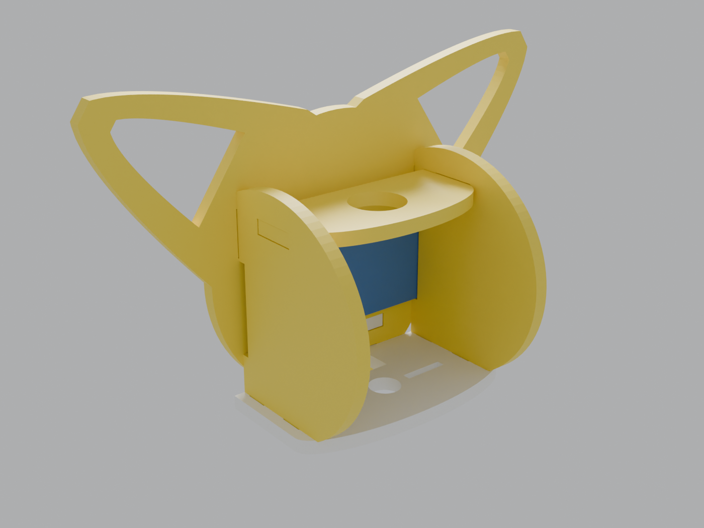
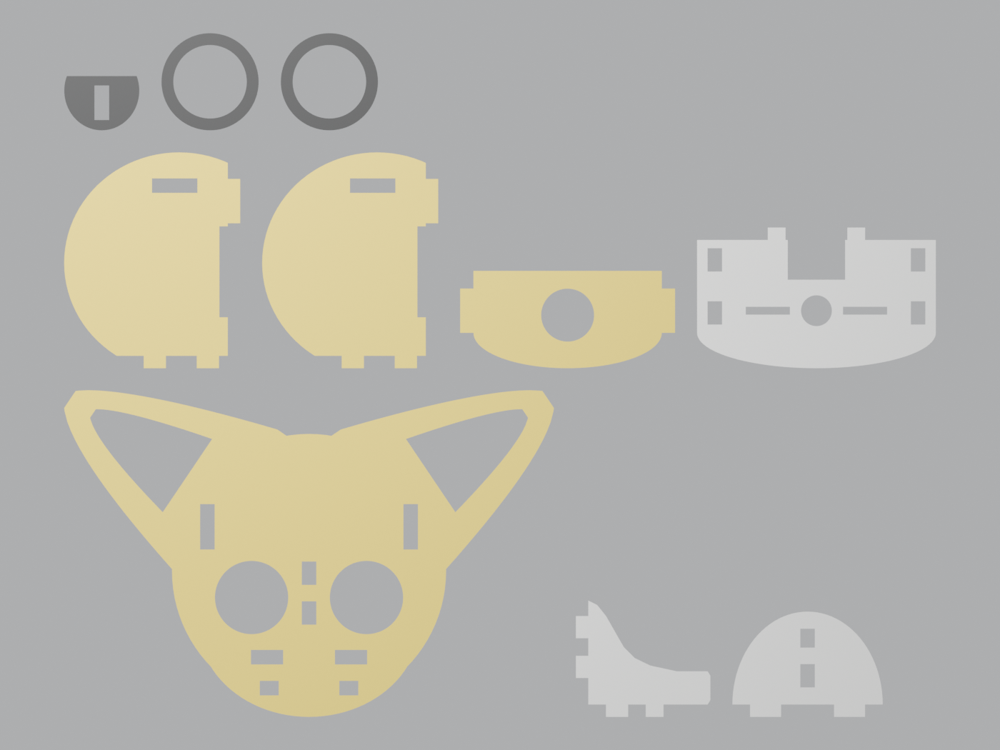

# CyberPup chihuahua head

A robot chihuahua head built the same way as the robot cat. Every part is a flat
3 mm profile, and the 3D head comes from slotting the profiles together with
tabs and windows. The HC-SR04 ultrasonic sensor makes the eyes.



| Front | Side | Back |
|---|---|---|
|  |  |  |

## Parts



| Part | Qty | What it does |
|---|---|---|
| `face` | 1 | Front plate with the apple-dome skull, the large ears, and holes for the sensor's transducers. Every other part plugs into it. |
| `side` | 2 | Give the skull depth. A pocket at the front grips the edges of the HC-SR04 board, holding it against the back of the face. |
| `crown` | 1 | Ties the two side plates together over the skull, with a hole for cables. |
| `base` | 1 | Neck plate. It has a servo-horn hub hole and slots for an SG90/MG90 horn, and a notch for the sensor's pins and cable. |
| `snout` | 1 | Fin down the middle of the face, forming the nose bridge and muzzle profile. It sits between the eyes. |
| `muzzle` | 1 | The muzzle as seen from above. The snout fin sits on it. |
| `nose` | 1 | Slides onto the tip of the snout fin. |
| `eye_ring` | 2 | 2 mm bezels around the transducers. |

Files:
- `stl/`: one STL per part, lying flat and ready to print. The `_x2` suffix in a file name is the quantity to print.
- `svg/` and `dxf/`: the 2D outline of each part. Use them to laser cut 3 mm ply or acrylic, or import a DXF into Fusion 360 as a sketch (Insert → Insert DXF) and extrude it 3 mm.
- `chihuahua_head.blend`: a Blender file with two collections, the assembly and the print layout.

## Assembly

1. Push the transducers through the eye holes from behind, so the board sits flat against the back of the face plate.
2. Plug the side plates' bottom tabs into the base plate and fit the crown between the side plates. Then slide that sub-assembly forward into the face plate. The side plates' tabs go into the upper windows, the base tabs go into the bottom windows, and the pockets capture the edges of the sensor board.
3. Plug the muzzle into the face plate, drop the snout fin onto the muzzle and into the face, then push the nose onto the tip of the snout.
4. Glue on the eye rings, and screw the servo horn to the underside of the base plate.

The windows have 0.15 mm clearance per side, so the fit is snug. A dab of glue on each joint makes it permanent.

## Changing the design

Everything is generated by `chihuahua_head.py`. The parameters at the top control plate thickness, clearance, sensor size, eye spacing, ear size, angle and position, plate heights, and the servo horn pattern.

```bash
# Blender GUI: open the Scripting tab, open chihuahua_head.py, click Run Script
blender -b -P chihuahua_head.py -- --out . --render   # headless Blender
pip install bpy && python chihuahua_head.py --out . --render   # no Blender install needed
```

Each build also checks the design:
- It confirms every part is manifold and in one piece.
- It intersects every pair of assembled parts, including a dummy HC-SR04, and reports any overlap. Every tab has to sit in its window for this to pass.
